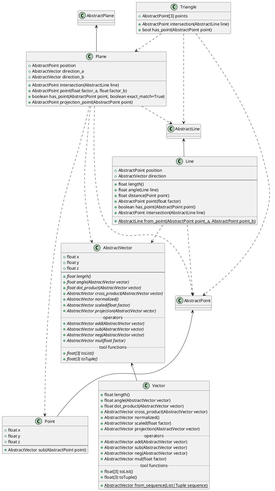

# Welcome

It's an overview of the classes and its relationships:

```plantuml
@startuml
AbstractLine <-- Line
AbstractPoint <-- Point
AbstractVector <-- Vector
AbstractPlane <-- Plane

Line ..> AbstractPoint
Line ..> AbstractVector

Triangle ..> AbstractPoint
Triangle ..> AbstractLine
Triangle ..> Plane

Plane ..> Point
Plane ..> AbstractPoint
Plane ..> AbstractVector
Plane ..> AbstractLine

class AbstractVector {
    + float x
    + float y
    + float z
    --
    {abstract} + float length()
    {abstract} + float angle(AbstractVector vector)
    {abstract} + float dot_product(AbstractVector vector)
    {abstract} + AbstractVector cross_product(AbstractVector vector)
    {abstract} + AbstractVector normalized()
    {abstract} + AbstractVector scaled(float factor)
    {abstract} + AbstractVector projection(AbstractVector vector)
    .. operators ..
    {abstract} + AbstractVector add(AbstractVector vector)
    {abstract} + AbstractVector sub(AbstractVector vector)
    {abstract} + AbstractVector neg(AbstractVector vector)
    {abstract} + AbstractVector mul(float factor)
    .. tool functions ..
    {abstract} + float[3] toList()
    {abstract} + float(3) toTuple()
}

class Vector {
    + float length()
    + float angle(AbstractVector vector)
    + float dot_product(AbstractVector vector)
    + AbstractVector cross_product(AbstractVector vector)
    + AbstractVector normalized()
    + AbstractVector scaled(float factor)
    + AbstractVector projection(AbstractVector vector)
    .. operators ..
    + AbstractVector add(AbstractVector vector)
    + AbstractVector sub(AbstractVector vector)
    + AbstractVector neg(AbstractVector vector)
    + AbstractVector mul(float factor)
    .. tool functions ..
    + float[3] toList()
    + float(3) toTuple()
    ..
    {static} + AbstractVector from_sequence(List|Tuple sequence)
}

class Point {
    + float x
    + float y
    + float z
    --
    + AbstractVector sub(AbstractPoint point)
}

class Line {
    + AbstractPoint position
    + AbstractVector direction
    --
    + float length()
    + float angle(Line line)
    + float distance(Point point)
    + AbstractPoint point(float factor)
    + boolean has_point(AbstractPoint point)
    + AbstractPoint intersection(AbstractLine line)
    ..
    {static} + AbstractLine from_point(AbstractPoint point_a, AbstractPoint point_b)
}

class Plane {
    + AbstractPoint position
    + AbstractVector direction_a
    + AbstractVector direction_b

    + AbstractPoint intersection(AbstractLine line)
    + AbstractPoint point(float factor_a, float factor_b)
    + boolean has_point(AbstractPoint point, boolean exact_match=True)
    + AbstractPoint projection_point(AbstractPoint point)
}

class Triangle {
    + AbstractPoint[3] points
    + AbstractPoint intersection(AbstractLine line)
    + bool has_point(AbstractPoint point)
}
@enduml
```
